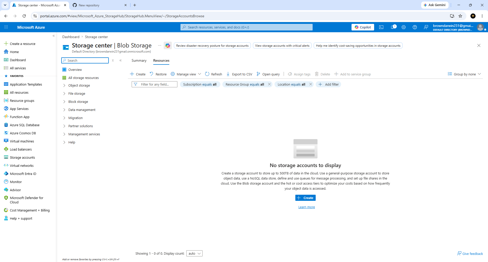
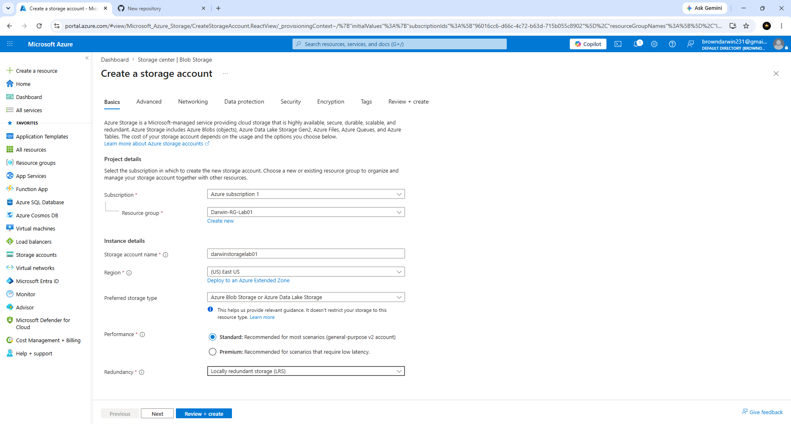
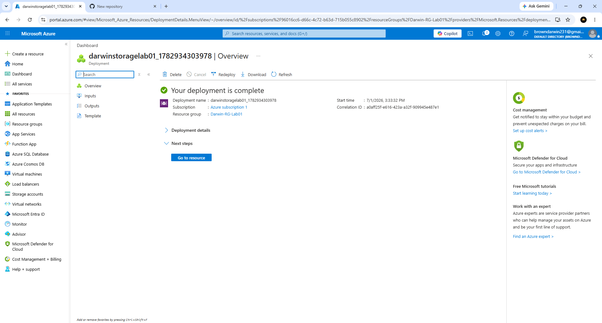

# Darwin-Azure-Storage-Account-Lab
Help Desk Azure lab demonstrating the creation and deployment of an Azure Storage Account.

## Overview

This project demonstrates how to create and deploy an Azure Storage Account using the Microsoft Azure Portal. It covers configuring storage settings, validating deployment, and verifying the resource after creation.

## Objectives

- Create an Azure Storage Account
- Configure storage settings
- Deploy cloud resources
- Verify successful deployment
- Review the Storage Account Overview

## Technologies Used

- Microsoft Azure
- Azure Portal
- Azure Storage Account
- Azure Resource Groups

## Skills Demonstrated

- Cloud Administration
- Azure Resource Management
- Storage Account Configuration
- Resource Deployment
- Azure Portal Navigation
- Help Desk Fundamentals
- Documentation

## Screenshots

## Overview

This project demonstrates how to create and deploy an Azure Storage Account using the Microsoft Azure Portal. It covers configuring storage settings, validating deployment, and verifying the resource after creation.

## Objectives

- Create an Azure Storage Account
- Configure storage settings
- Deploy cloud resources
- Verify successful deployment
- Review the Storage Account Overview

## Technologies Used

- Microsoft Azure
- Azure Portal
- Azure Storage Account
- Azure Resource Groups

## Skills Demonstrated

- Cloud Administration
- Azure Resource Management
- Storage Account Configuration
- Resource Deployment
- Azure Portal Navigation
- Help Desk Fundamentals
- Documentation

## Screenshots

### 1. The Azure Dashboard

Opened the Microsoft Azure Dashboard to begin creating a new Azure Storage Account.

---

### 2. Storage Account Page

Opened the Azure Storage Accounts page to prepare for creating a new storage account.

---

### 3. Create Storage Account Basics

Configured the Storage Account basics including subscription, resource group, region, performance, and redundancy.

---

### 4. Storage Account Review and Create

Reviewed the Storage Account configuration before deployment.

---

### 5. Azure storage Account Deployment Complete

Successfully deployed the Azure Storage Account.

---

## Key Takeaways

- Created an Azure Storage Account
- Configured cloud storage settings
- Deployed Azure resources successfully
- Verified deployment status
- Practiced Azure cloud administration using the Azure Portal

## Author

**Darwin Brown**

---

## Key Takeaways

- Created an Azure Storage Account
- Configured cloud storage settings
- Deployed Azure resources successfully
- Verified deployment status
- Practiced Azure cloud administration using the Azure Portal

## Author

**Darwin BrownJR**

Aspiring Help-Desk
